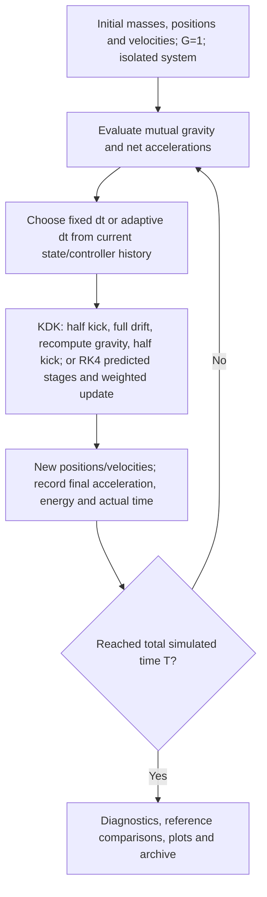

# Interactive N-Body Lab

**A Python laboratory for Newtonian N-body dynamics, numerical-error analysis, adaptive time stepping, and CPU/CUDA comparisons.**

This is the current iteration of **N-Body-Simulation**. The main application is [`interactive_nbody_lab.py`](interactive_nbody_lab.py). The publication keeps the numerical algorithms unchanged and makes the image-export default point to the local output folder. It brings the original model, conservation diagnostics, acceleration tracking, adaptive steps, optional GPU computation, and repeatable batch experiments into one desktop interface.

This is an educational and computational-research project under active development. Implemented features and tested cases are listed separately from future work; a numerically computed reference trajectory is not an exact analytic answer.

Sister project: [Neutron-Star-Modeling](https://github.com/Charlie-Zhao-666/Neutron-Star-Modeling).

## Current capabilities

| Area | Implemented functionality | Validation / scope |
|---|---|---|
| Physical model | Direct pairwise Newtonian gravity in 3D; positions, velocities, and masses; computational units with G=1 | Finite-precision point masses; no softening, collisions, or merger prescription |
| Integration | Leapfrog kick-drift-kick (KDK) and classical fourth-order Runge-Kutta (RK4) | Both exercised in step scans and Figure-8 / Butterfly I comparisons |
| Initial conditions | Random seed, specified seed, and 14 catalog initial-condition options | Published numerical initial conditions have finite precision; some classical cases have analytic orbits, but the catalog is not a set of analytic position functions |
| Error analysis | Energy, momentum, angular momentum and center-of-mass velocity; RMSE and normalized energy RMSE | Conservation error alone does not certify trajectory accuracy |
| Position comparisons | Reference-based position RMSE/NRMSE; optional comparison with the previous executed test | Identical initial masses/positions/velocities/order; common physical-time grid with cubic Hermite interpolation |
| Acceleration and motion | Per-particle net acceleration and velocity records; select any star; distance traveled during the recorded step | Acceleration and energy views share an actual-dt overlay; energy can be displayed as E or E-E(0) |
| Adaptive steps | Pairwise timescale controller with eta; acceleration-ratio controller with adjustable N and exponent cap K | Both implemented and compared on Butterfly I; adaptive stepping does not automatically preserve fixed-step leapfrog's geometric properties |
| CPU / GPU | NumPy/Python CPU path and optional CuPy RawKernel CUDA path, float64 | GPU backend implemented; a 5-body/10-step CPU-GPU smoke check passed on RTX 5090 for both integrators; systematic crossover and numerical-equivalence studies remain **planned** |
| Desktop interaction | Tkinter/Matplotlib interface, draggable timeline and time cursor, hover readout, star selection, fixed/follow/fit-all camera views | Rendering remains CPU-based; GPU computation does not imply GPU-accelerated plotting |
| Batch testing | Editable Test mode, JSON plans, reference-first execution, automatic run saving | Smallest dt is the default reference; an explicitly selected reference always runs first |
| Records and export | Aligned DAT history, JSON summaries, PNG conservation plots, full NPZ batch arrays, optional animation export | Local runs are written beside the script; large raw arrays are excluded from this Git repository |

## Quick start

Install Python with Tk support, then install the CPU requirements and launch the interface:

```sh
python -m pip install -r requirements.txt
python interactive_nbody_lab.py
```

`stable_orbits.py` must remain beside the application. Tkinter ships with the standard Windows Python installer; other operating systems may require their distribution's Tk package. This release was tested locally with Python 3.14, NumPy 2.4.3, Matplotlib 3.10.8, Pillow 12.1.1, and python-dateutil 2.9.0.post0.

In the main window, choose initial conditions, integrator, **dt**, **total simulated time T**, diagnostics sampling and CPU/GPU. Start the run to compute the trajectory and inspect the resulting tabs. Here **T is physical simulation time in code units**, not a step count. `Steps_set=ceil(T/dt)`; adaptive runs can execute more steps.

For GPU mode, install a CuPy package compatible with your NVIDIA driver/CUDA environment using the [official CuPy installation guide](https://docs.cupy.dev/en/stable/install.html). The author's environment has `cupy-cuda13x 14.2.0`; that is not a requirement for every machine. CPU mode does not require CuPy.

### Repeatable batch experiments

The [original four experiments and two supplementary trials](plans/historical/README.md) now have loadable plans mapped to their historical data rows.

Open **Test mode**, use **Load plan**, and select a JSON file from [`plans/`](plans/). Each plan contains initial conditions, dt, integrator, total duration, diagnostics settings and position-comparison settings. Start the batch to run the cases sequentially.

- The reference runs first, even if a different case has a shorter dt.
- Other cases run in ascending configured dt order.
- Each completed test saves its parameters, diagnostics, conservation figure and full per-step arrays.
- Position errors are evaluated at shared physical times; comparing equal array indices would be incorrect when time steps differ.
- `reference_N` in the history denotes a reference shared by N completed comparisons. Unrequested/unavailable metrics are `NA`.
- Large plans can use substantial time and RAM because the current application retains every step. The long-time and Butterfly plans should be run deliberately.

## Published experiments and results

Browse the [run history and clickable images](data/run-history/README.md), the [full aligned runs.dat](data/run-history/runs.dat), and the [test log](docs/test_report.txt).

The 2026-10-07 suite completed **45 runs on an Intel Core i9-13900K CPU**, with full local trajectory archives. These are **CPU results**, not evidence of GPU speedup.

| Lines in runs.dat | Experiment | Cases |
|---|---|---:|
| 77-81 | Figure-8 numerical-reference validation, T=6.5 | 5 |
| 82-100 | Figure-8 cost/accuracy scans, three repeats per tested method/dt | 19 |
| 101-104 | Figure-8 long-time comparison, T=65 | 4 |
| 105-108 | Figure-8 long-time comparison, T=650 | 4 |
| 109-121 | Butterfly I fixed steps, timescale adaptation and acceleration-ratio adaptation | 13 |

[Full results, settings, limitations and six comparison plots](docs/reports/2026-10-07/results.md).


Within these Figure-8 tests, RK4 produces smaller position differences at similar or slightly lower measured CPU cost than the paired KDK cases, including at T=650. On Butterfly I, the tested fixed RK4 h/4 case is both faster and more accurate in position than the three tested acceleration-ratio settings. These are findings for the tested initial conditions, durations, implementations and references, not a universal ranking of integrators.

Energy figures distinguish bounded oscillations from drift. KDK can preserve angular momentum more accurately while having a larger position error. The detailed comparison additionally resamples recorded energy onto common physical times, because native diagnostic sampling differs between adaptive modes.

## Repository layout and version strategy

| Path | Purpose |
|---|---|
| `interactive_nbody_lab.py` | Current interactive application; published under an English filename |
| `stable_orbits.py` | Initial-condition catalog shared with the original program |
| `N body simulation.py` | Original console-driven program, retained for continuity |
| `Galaxies collision simulation.py` | Earlier separate galaxy-collision visualization demo |
| `requirements.txt` | CPU application dependencies |
| `plans/` | Loadable configurations for the published 45-run suite |
| `data/run-history/` | Lightweight published snapshot: tables, full-precision summaries, comparisons and 101 PNGs |
| `docs/test_report.txt` | Test descriptions and runs.dat line ranges |
| `docs/reports/2026-10-07/` | Detailed analysis, machine-readable metrics and summary figures |
| `docs/cpu_gpu_benchmark_plan.md` | Planned particle-count sweep and crossover protocol |
| `docs/ROADMAP.md` | Completed, unfinished and proposed work |

The interactive application belongs to the existing **main development line**, rather than a separate repository. Earlier versions remain available in Git history. The existing `time-step-tester`, `method-tester`, `no-z-component-test`, and `images` branches remain as historical/specialized work; their READMEs describe those versions, not the current interface. Future unvalidated changes can use short-lived feature branches before joining main.

For the original console program, `mplcursors` may also be needed; install it separately if you run that legacy entry point.

### Published data versus local outputs

The current published snapshot contains 103 run records and 101 conservation PNGs (about 12.8 MiB of PNGs); two legacy records lack images. Date/time names match the corresponding table rows. The `Plot` field uses relative filenames, and the Markdown gallery provides links usable directly on GitHub.

The approximately **12.2 GiB of local NPZ trajectories are not uploaded**. Historical batch JSON files retain their NPZ output names as provenance, but the raw arrays are not included. New local runs create a separate `graph and data/` folder beside the program, ignored by Git. `data/run-history/` is a published snapshot and is not overwritten by running the application. Keep full arrays locally or use a dedicated data archive for future releases. GitHub recommends keeping repositories small and blocks ordinary Git files above 100 MiB; see [GitHub's large-file guidance](https://docs.github.com/en/repositories/working-with-files/managing-large-files/about-large-files-on-github).

A publication smoke check used the same five-body initial state and 10 fixed steps on the CPU and an NVIDIA GeForce RTX 5090 for both integrators; saved positions agreed at the tested precision. This only checks a short execution path, not general trajectory equivalence or performance. [Check record](docs/reports/publication_checks.json).

## Next research question: where does GPU computation become worthwhile?

For each particle count, generate initial conditions once and give identical copies to CPU and GPU. Hold the integrator, precision, dt, total steps and recording policy fixed. Start with N=3,5,10,20,50,100 and extend until a sustained crossover is observed; refine the interval around that crossing. Repeat with several fixed seeds, warm up GPU execution, synchronize timing, and compare numerical results as well as speed.

Report both the application-level cost (including per-step recording/transfers) and a separately instrumented compute-only cost. The current GPU path transfers complete snapshots each step, and the CPU baseline uses Python pair loops, so a crossover measures **these implementations on the tested hardware**, not an intrinsic CPU/GPU boundary. Changing N also changes the physical initial system; the purpose of this sweep is performance, not physical convergence.

The detailed [benchmark plan](docs/cpu_gpu_benchmark_plan.md) explains the controls, timing boundaries, error checks and stop/refinement rules. No crossover measurement is claimed yet.

## Remaining work

- Systematic CPU/GPU performance and numerical-consistency validation.
- Lower-overhead GPU execution and reduced host/device transfers; more efficient CPU implementation.
- Chunked/on-disk trajectory recording to bound memory usage; safer long-run restart/resume.
- Broader reference convergence, analytic two-body benchmarks, long-time and close-encounter tests.
- Controlled experiments with gravitational softening or regularization; document any physical model change.
- Higher-order or alternative integrators beyond classical RK4; assess any method-switching scheme before adoption.
- A formal project report with reproducible figures and a wider suite of initial conditions.
- Dark-matter halo models and a physically specified galaxy-merger study; these are not part of the current point-mass validation suite.

See the [roadmap](docs/ROADMAP.md) for priorities and completion criteria.

## Model and interpretation notes

The simulation advances particle positions and velocities under their mutual gravity. For the current position-dependent force law, leapfrog uses an intermediate velocity for its position update; RK4 uses multiple predicted states and a weighted final update. Updated positions determine the next force evaluation. All recorded numerical values use code units with no automatic SI conversion.



No gravitational softening or exact-collision handling is currently applied. Very close encounters can require much smaller steps or produce invalid states. Published periodic initial conditions are finite-precision numerical data; not every three-body solution has an analytic time-to-position formula, and a visually closed orbit is not proof of numerical accuracy.

Orbit provenance and literature URLs are retained in `stable_orbits.py` and the interactive catalog, including Figure-8, classical two-body/Lagrange cases, Suvakov-Dmitrasinovic periodic initial conditions and the Li-Liao free-fall example. There is no claim that the whole catalog has undergone the same validation as the two cases tested here.
