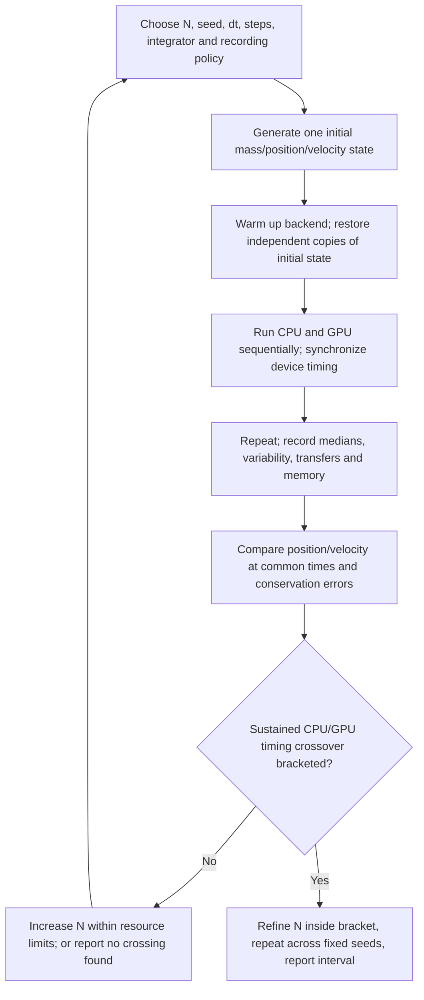

# Planned CPU/GPU crossover experiment

Status: **planned; not executed in the published 45-run CPU suite**.

## Question

At which particle counts does the current CUDA implementation finish the same simulation workload faster than the current CPU implementation, while preserving acceptable agreement in the numerical result?

A crossover depends on hardware, precision, integrator, implementation, number of steps, recording frequency and transfers. Do not describe one measurement as a universal CPU/GPU threshold.

## Controlled setup

1. Use specified-seed mode. Start with one fixed seed (for example 221024875), then repeat the scan with several predeclared seeds.
2. For each N, generate the masses, positions and velocities **once** with the program's CPU initial-state generator. Feed independent identical copies to each backend. Record the seed, actual arrays and library versions; a seed alone is not a permanent cross-version specification.
3. Use float64 on both backends. Hold G, integrator, initial conditions, dt, total step count and diagnostic/recording policy fixed within a CPU/GPU pair.
4. Start with fixed dt and KDK, then repeat as a separate RK4 series. Adaptive runs come later because they may choose different steps and require separate workload accounting.
5. Suggested initial sizes: N=3,5,10,20,50,100. If there is no sustained crossover, extend to 200,500,1000 as memory and runtime allow. A failure to cross below 100 is a result, not a reason to stop the study.
6. Begin with a modest fixed number of steps (e.g. 1000). Use a pilot to choose dt and duration that avoid under-resolved close encounters. Freeze that configuration before timing, and keep it fixed for every CPU/GPU pair. Document instability instead of silently dropping inconvenient cases.

The current random generator samples a fixed spatial/velocity range. Increasing N changes density and total mass. That is acceptable for a documented performance sweep, but is not a controlled physical convergence experiment. A fixed-density size-scaling family can be added as a separate study.

## Timing and repeats

- Run the competing backends sequentially, not simultaneously. Alternate their order across repeats to reduce ordering/thermal effects.
- Warm up CUDA context creation and kernel compilation, then reset the initial state before the measured run. Report cold-start latency separately if it matters to desktop use.
- Synchronize GPU completion before stopping a wall timer; use CUDA events / `cupyx.profiler.benchmark` for isolated device work. CPU wall timers alone can measure asynchronous launch rather than completion.
- For a first pass use three measured repeats; refine the crossover region with at least five repeats and several fixed seeds. Report median, range or interquartile range, not just the fastest run.
- Record CPU model/thread settings, GPU model/driver, CuPy/CUDA/NumPy versions, dtype, particle count, actual steps, recording cadence and peak memory.

Official timing guidance: [CuPy performance best practices](https://docs.cupy.dev/en/stable/user_guide/performance.html).

## Two cost definitions

**Application-level:** the existing simulation, including force evaluation, integration, reductions, recorded snapshots and device-to-host transfers. Keep GUI drawing and PNG/NPZ compression outside the simulation timer, and optionally report them as separate user-visible costs. `Compute_time_s` already excludes later plotting/saving, but it also excludes initial GPU construction; record that timing boundary explicitly.

**Compute-only:** separately instrument stepping/gravity with device-resident state. Do not label the current `Compute_time_s` as pure kernel time: the GPU implementation transfers positions, velocities, accelerations and scalars to the host every step. Any benchmark-only change must be explicit and must not silently change the physical calculation.

The current CPU and GPU paths also do not use identical operation counts: CPU uses pair symmetry and Python loops, while GPU threads sum contributions per particle. State the implementation being compared; a later optimized CPU baseline is a separate comparison.

## Numerical checks and output

For each pair, compare positions and velocities at the same physical times, plus energy and momentum/angular-momentum diagnostics. Different reduction orders can cause floating-point differences; CPU is not automatically the exact answer. Use a converged independent reference where needed to evaluate physical trajectory accuracy, especially when trajectories diverge.

Record: N, seed/initial-state identifier, method, dt, total simulated time, actual steps, backend, repeat, warm/cold timing status, timing definition, computation seconds, transfer/export seconds when available, position/velocity differences, conservation errors and peak memory.

Define speedup as `median CPU seconds / median GPU seconds`. Values above 1 mean GPU is faster under that timing definition. Identify a bracket where the ratio crosses 1 consistently, then sample more N values inside it. Treat overlapping repeat ranges or non-monotonic points as an uncertain interval, not an exact threshold.

Expected figures: median time versus N; speedup versus N with repeat spread; numerical discrepancy versus N; application-level versus compute-only costs. These figures have not yet been produced.
