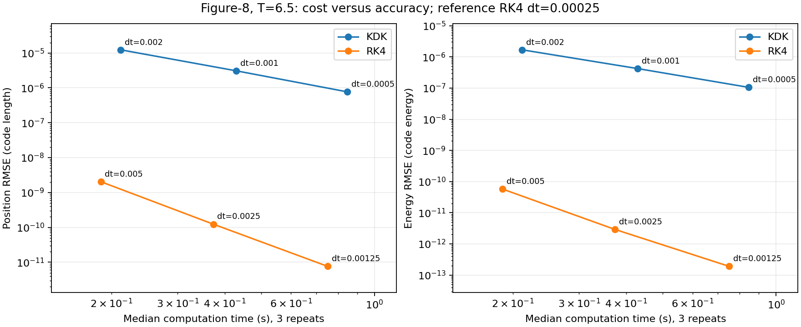
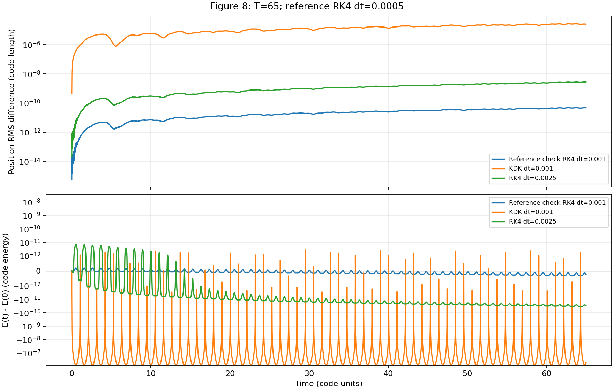
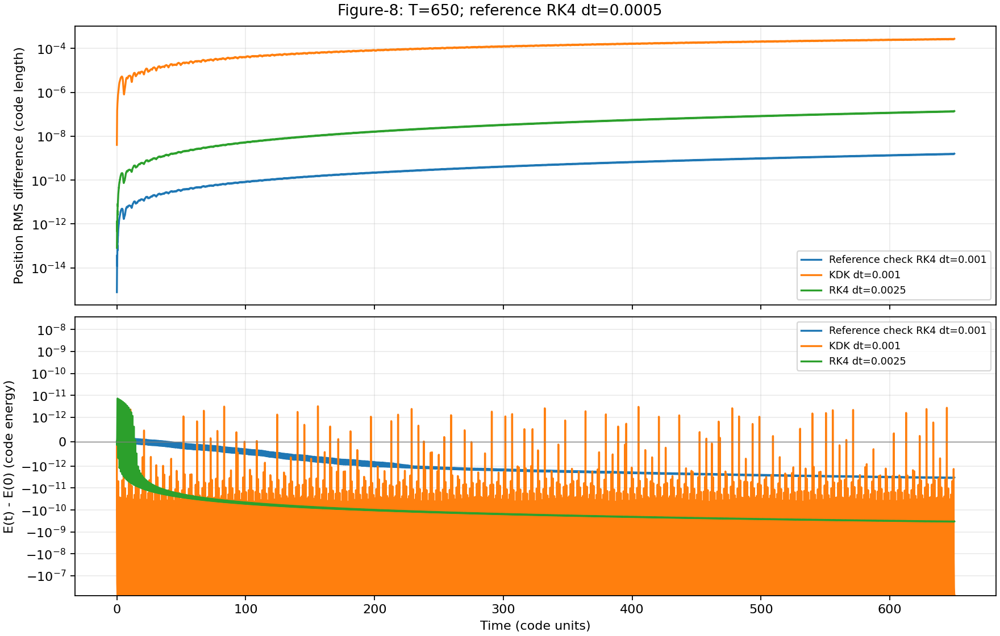
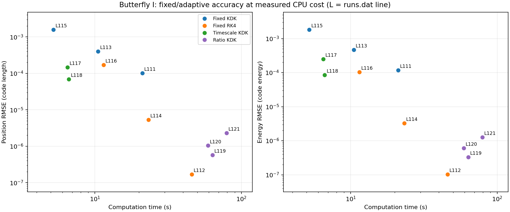
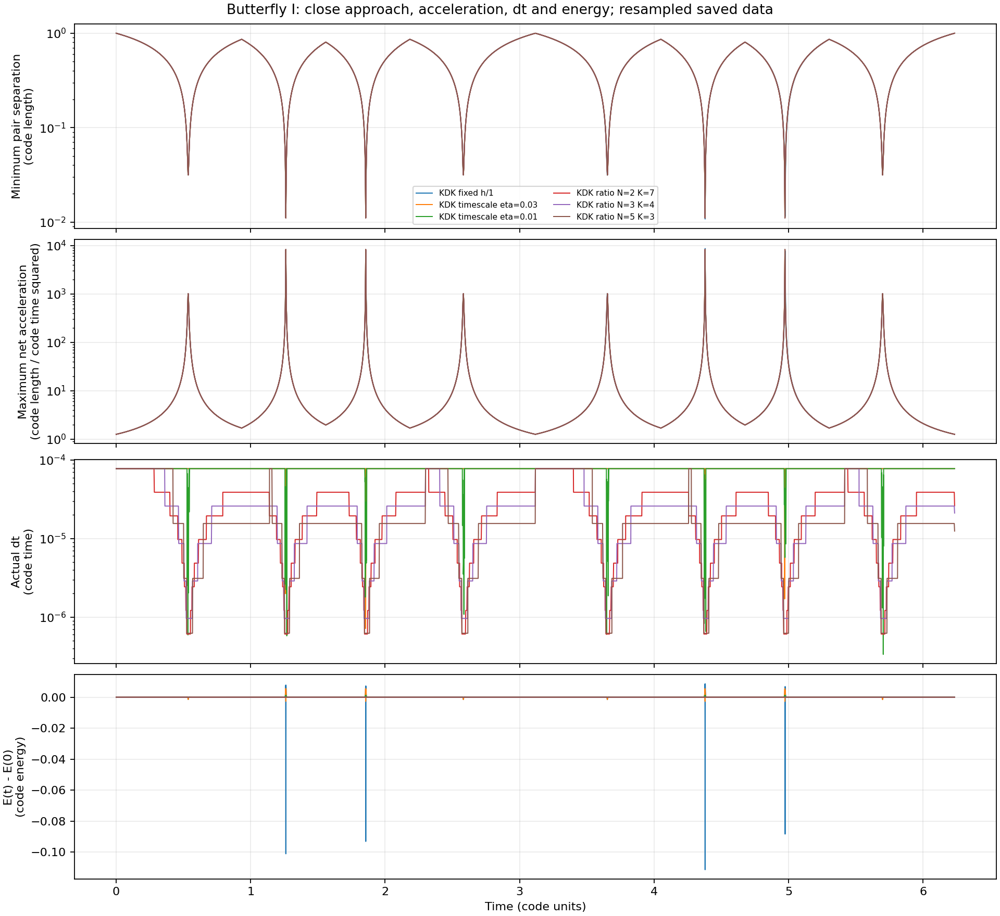
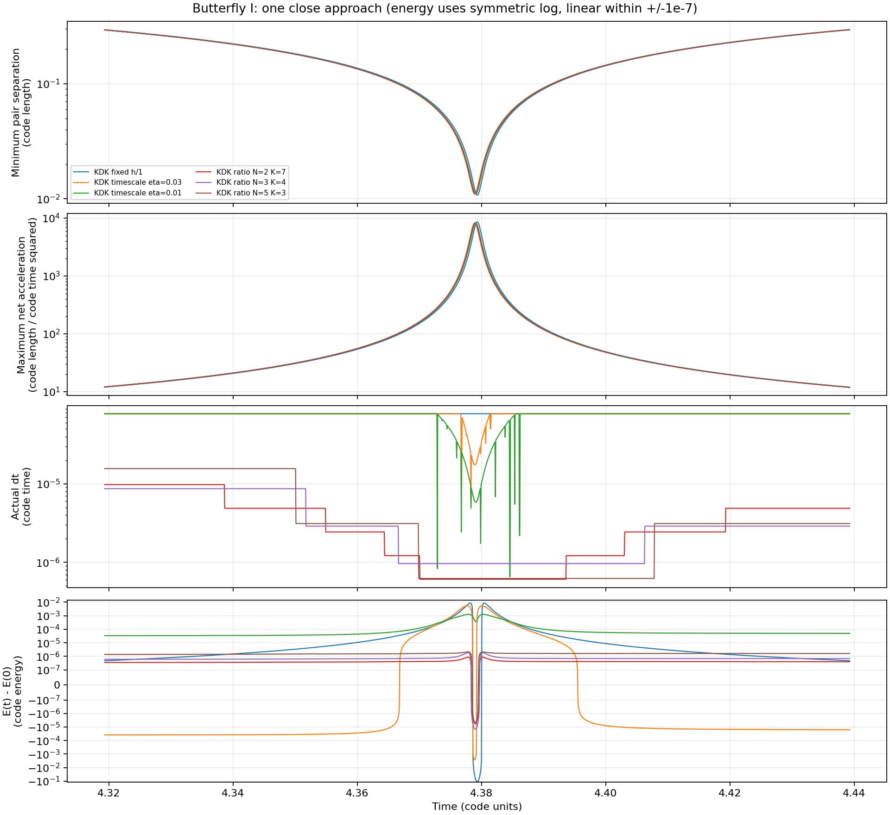

# Local CPU test results - 2026-10-07

All 45 simulations used the local Intel Core i9-13900K CPU, float64, and the tested interactive program (published as interactive_nbody_lab.py). No GPU or remote/cloud compute was used.
Python: 3.14 (local Windows installation).
Source SHA256: `63e25a5172ec8695c3c98f894da9ed78d7b3ab8465a6e293580abf542e2f8c2f`

Line numbers refer to runs.dat as verified after this suite. Position RMSE is relative to each batch reference, not an exact analytic solution. Energy RMSE below uses the same 100001 physical times within each batch (linear interpolation of recorded energies); native runs.dat values are preserved. Short timings use three repeats. Longer/adaptive timings are single measurements.

## Figure-8 reference validation, T=6.5 (lines 77-81)

| Line | Test | Steps | Compute s | Position RMSE | Uniform energy RMSE | Final energy offset |
|---:|---|---:|---:|---:|---:|---:|
| 77 | Reference RK4 dt=0.00025 | 26000 | 3.7028 | reference | 9.700682e-15 | 2.309264e-14 |
| 78 | Reference check RK4 dt=0.0005 | 13000 | 1.8420 | 1.825169e-13 | 1.459357e-14 | 1.798561e-14 |
| 79 | Original reference RK4 dt=0.001 | 6500 | 1.0840 | 3.116452e-12 | 8.011865e-14 | -3.419487e-14 |
| 80 | KDK dt=0.001 | 6500 | 0.4928 | 3.076806e-06 | 4.209801e-07 | -1.235117e-07 |
| 81 | RK4 dt=0.0025 | 2600 | 0.3626 | 1.236280e-10 | 2.934477e-12 | -3.382850e-12 |

## Figure-8 cost versus accuracy, three timing repeats (lines 82-100)

| Line | Test | Steps | Compute s | Position RMSE | Uniform energy RMSE | Final energy offset |
|---:|---|---:|---:|---:|---:|---:|
| 82 | Reference RK4 dt=0.00025 | 26000 | 3.6778 | reference | 9.700682e-15 | 2.309264e-14 |
| 83 | KDK dt=0.0005 repeat 1 | 13000 | 0.8454 | 7.692054e-07 | 1.052453e-07 | -3.087844e-08 |
| 84 | KDK dt=0.0005 repeat 2 | 13000 | 0.8538 | 7.692054e-07 | 1.052453e-07 | -3.087844e-08 |
| 85 | KDK dt=0.0005 repeat 3 | 13000 | 0.8460 | 7.692054e-07 | 1.052453e-07 | -3.087844e-08 |
| 86 | KDK dt=0.001 repeat 1 | 6500 | 0.4294 | 3.076806e-06 | 4.209801e-07 | -1.235117e-07 |
| 87 | KDK dt=0.001 repeat 2 | 6500 | 0.4295 | 3.076806e-06 | 4.209801e-07 | -1.235117e-07 |
| 88 | KDK dt=0.001 repeat 3 | 6500 | 0.4233 | 3.076806e-06 | 4.209801e-07 | -1.235117e-07 |
| 89 | RK4 dt=0.00125 repeat 1 | 5200 | 0.7518 | 7.614462e-12 | 1.906697e-13 | -1.052491e-13 |
| 90 | RK4 dt=0.00125 repeat 2 | 5200 | 0.7491 | 7.614462e-12 | 1.906697e-13 | -1.052491e-13 |
| 91 | RK4 dt=0.00125 repeat 3 | 5200 | 0.7506 | 7.614462e-12 | 1.906697e-13 | -1.052491e-13 |
| 92 | KDK dt=0.002 repeat 1 | 3250 | 0.2119 | 1.230698e-05 | 1.683905e-06 | -4.940160e-07 |
| 93 | KDK dt=0.002 repeat 2 | 3250 | 0.2106 | 1.230698e-05 | 1.683905e-06 | -4.940160e-07 |
| 94 | KDK dt=0.002 repeat 3 | 3250 | 0.2184 | 1.230698e-05 | 1.683905e-06 | -4.940160e-07 |
| 95 | RK4 dt=0.0025 repeat 1 | 2600 | 0.3686 | 1.236280e-10 | 2.934477e-12 | -3.382850e-12 |
| 96 | RK4 dt=0.0025 repeat 2 | 2600 | 0.3729 | 1.236280e-10 | 2.934477e-12 | -3.382850e-12 |
| 97 | RK4 dt=0.0025 repeat 3 | 2600 | 0.3807 | 1.236280e-10 | 2.934477e-12 | -3.382850e-12 |
| 98 | RK4 dt=0.005 repeat 1 | 1300 | 0.1853 | 2.034712e-09 | 5.779711e-11 | -1.074454e-10 |
| 99 | RK4 dt=0.005 repeat 2 | 1300 | 0.1876 | 2.034712e-09 | 5.779711e-11 | -1.074454e-10 |
| 100 | RK4 dt=0.005 repeat 3 | 1300 | 0.1890 | 2.034712e-09 | 5.779711e-11 | -1.074454e-10 |

## Figure-8 long-time test T=65 (lines 101-104)

| Line | Test | Steps | Compute s | Position RMSE | Uniform energy RMSE | Final energy offset |
|---:|---|---:|---:|---:|---:|---:|
| 101 | Reference RK4 dt=0.0005 | 130000 | 18.6783 | reference | 2.588704e-14 | -5.995204e-15 |
| 102 | Reference check RK4 dt=0.001 | 65000 | 9.3465 | 2.658045e-11 | 1.578164e-13 | -2.335909e-13 |
| 103 | KDK dt=0.001 | 65000 | 4.3442 | 1.557102e-05 | 4.274453e-07 | -5.317286e-07 |
| 104 | RK4 dt=0.0025 | 26000 | 3.7433 | 1.438479e-09 | 1.788161e-11 | -3.046585e-11 |

## Figure-8 long-time test T=650 (lines 105-108)

| Line | Test | Steps | Compute s | Position RMSE | Uniform energy RMSE | Final energy offset |
|---:|---|---:|---:|---:|---:|---:|
| 105 | Reference RK4 dt=0.0005 | 1300000 | 188.7655 | reference | 5.747494e-14 | -3.175238e-14 |
| 106 | Reference check RK4 dt=0.001 | 650000 | 92.2601 | 7.309762e-10 | 1.951491e-12 | -3.300915e-12 |
| 107 | KDK dt=0.001 | 650000 | 42.6551 | 1.533080e-04 | 4.266481e-07 | -7.567933e-07 |
| 108 | RK4 dt=0.0025 | 260000 | 37.4673 | 6.213658e-08 | 1.940756e-10 | -3.319927e-10 |

## Butterfly I fixed and adaptive cost versus accuracy (lines 109-121)

| Line | Test | Steps | Compute s | Position RMSE | Uniform energy RMSE | Final energy offset |
|---:|---|---:|---:|---:|---:|---:|
| 109 | Reference RK4 h/20 | 1600000 | 229.3350 | reference | 2.179835e-11 | -3.689582e-11 |
| 110 | Reference check RK4 h/10 | 800000 | 114.9096 | 1.746662e-09 | 1.055383e-09 | -1.741888e-09 |
| 111 | KDK fixed h/4 | 320000 | 21.0999 | 1.006963e-04 | 1.173414e-04 | 2.641887e-12 |
| 112 | RK4 fixed h/4 | 320000 | 45.8012 | 1.681563e-07 | 1.025511e-07 | -1.702007e-07 |
| 113 | KDK fixed h/2 | 160000 | 10.5105 | 4.015169e-04 | 4.670964e-04 | 7.935874e-13 |
| 114 | RK4 fixed h/2 | 160000 | 23.1868 | 5.337739e-06 | 3.277473e-06 | -5.440526e-06 |
| 115 | KDK fixed h/1 | 80000 | 5.2165 | 1.587694e-03 | 1.837154e-03 | 1.709655e-11 |
| 116 | RK4 fixed h/1 | 80000 | 11.4500 | 1.696508e-04 | 1.045638e-04 | -1.736172e-04 |
| 117 | KDK timescale eta=0.03 | 80353 | 6.5111 | 1.455896e-04 | 2.483808e-04 | -5.935848e-05 |
| 118 | KDK timescale eta=0.01 | 82488 | 6.6468 | 6.896021e-05 | 8.460898e-05 | 6.395282e-05 |
| 119 | KDK ratio N=2 K=7 | 827833 | 63.4264 | 5.730281e-07 | 3.295291e-07 | 5.135895e-07 |
| 120 | KDK ratio N=3 K=4 | 774867 | 59.1053 | 1.037459e-06 | 6.053712e-07 | 8.996537e-07 |
| 121 | KDK ratio N=5 K=3 | 1042409 | 79.1330 | 2.315320e-06 | 1.269181e-06 | 2.127226e-06 |

## Median timings for Figure-8 cost scan

| Method | dt | Lines | Median s | Min s | Max s | Position RMSE |
|---|---:|---|---:|---:|---:|---:|
| KDK | 0.0005 | [83, 84, 85] | 0.84604 | 0.84540 | 0.85383 | 7.692054e-07 |
| KDK | 0.001 | [86, 87, 88] | 0.42935 | 0.42327 | 0.42953 | 3.076806e-06 |
| KDK | 0.002 | [92, 93, 94] | 0.21186 | 0.21061 | 0.21836 | 1.230698e-05 |
| RK4 | 0.00125 | [89, 90, 91] | 0.75061 | 0.74909 | 0.75179 | 7.614462e-12 |
| RK4 | 0.0025 | [95, 96, 97] | 0.37291 | 0.36863 | 0.38074 | 1.236280e-10 |
| RK4 | 0.005 | [98, 99, 100] | 0.18759 | 0.18528 | 0.18897 | 2.034712e-09 |

## Interpretation

- Figure-8 reference check: halving RK4 dt from 0.0005 to 0.00025 changes the trajectory by 1.825e-13 RMS, well below the 1.236e-10 difference for RK4 dt=0.0025. These remain numerical references, not exact solutions.
- Figure-8 cost scan: across all three tested cost levels, RK4 gives much smaller position differences at slightly lower measured median runtime than the paired KDK runs. These are results for this implementation and these initial conditions.
- At T=650, KDK dt=0.001 takes 42.655 s with position RMSE 1.533e-4; RK4 dt=0.0025 takes 37.467 s with position RMSE 6.214e-8. RK4 energy shows a small negative drift; KDK energy predominantly oscillates. No claim about arbitrarily long times follows.
- Butterfly I reference check h/10 versus h/20 differs by 1.747e-9 RMS, about 96 times smaller than the smallest non-reference position RMSE in this scan.
- Butterfly I timescale eta=0.01 reduces KDK position RMSE from 1.588e-3 to 6.896e-5 while runtime rises from 5.216 s to 6.647 s. Ratio N=2,K=7 reaches 5.730e-7 but takes 63.426 s. Fixed RK4 h/4 achieves a smaller 1.682e-7 in 45.801 s; thus the tested ratio settings do not outperform it on either runtime or position error.
- Position accuracy and energy/ angular-momentum conservation are different criteria. The complete native conservation statistics and plots are retained for every run. Do not equate small final energy offset with small error throughout the trajectory.

## Plots

Long-time energy panels use a symmetric logarithmic axis (linear within +/-1e-12). Butterfly close-approach panels use logarithmic separation, acceleration and dt axes. Labels Lxxx identify runs.dat lines.

